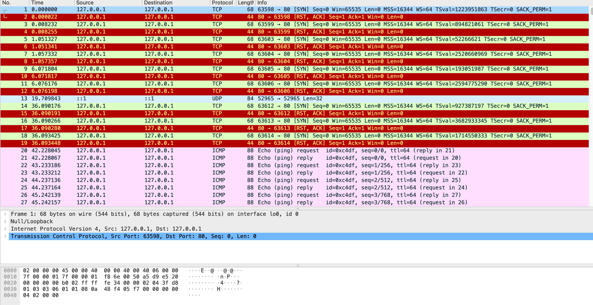

HTTP/1.1 主要的变更点有：
增加了 PUT、DELETE 等新的方法；
增加了缓存管理和控制；
明确了连接管理，允许持久连接；
允许响应数据分块（chunked），利于传输大文件；
强制要求 Host 头，让互联网主机托管成为可能。

缺点：
主要就是连接慢

HTTP/2 的制定充分考虑了现今互联网的现状：
宽带、移动、不安全，在高度兼容 HTTP/1.1 的同时在性能改善方面做了很大努力，

主要的特点有：二进制协议，不再是纯文本；
可发起多个请求，废弃了 1.1 里的管道；
使用专用算法压缩头部，减少数据传输量；
允许服务器主动向客户端推送数据；
增强了安全性，“事实上”要求加密通信。

HTTP 就是超文本传输协议，也就是 HyperText Transfer Protocol

它可以拆成三个部分，分别是：“超文本”“传输”和“协议”

HTTP 是一个用在计算机世界里的协议。它使用计算机能够理解的语言确立了一种计算机之间交流通信的规范，以及相关的各种控制和错误处理方式。

HTTP 是一个“传输协议”，所谓的“传输”（Transfer）其实很好理解，就是把一堆东西从 A 点搬到 B 点，或者从 B 点搬到 A 点，即“A<===>B”。
HTTP 是一个在计算机世界里专门用来在两点之间传输数据的约定和规范。

“文本”（Text），就表示 HTTP 传输的不是 TCP/UDP 这些底层协议里被切分的杂乱无章的二进制包（datagram），而是完整的、有意义的数据，可以被浏览器、服务器这样的上层应用程序处理。
“超文本”，就是“超越了普通文本的文本”，它是文字、图片、音频和视频等的混合体，最关键的是含有“超链接”，能够从一个“超文本”跳跃到另一个“超文本”，形成复杂的非线性、网状的结构关系。

编程语言是人与计算机沟通交流所使用的语言，而 HTTP 是计算机与计算机沟通交流的语言。

