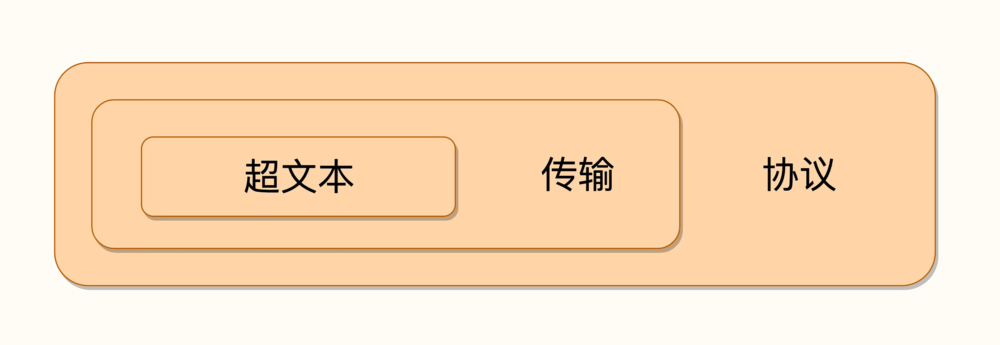
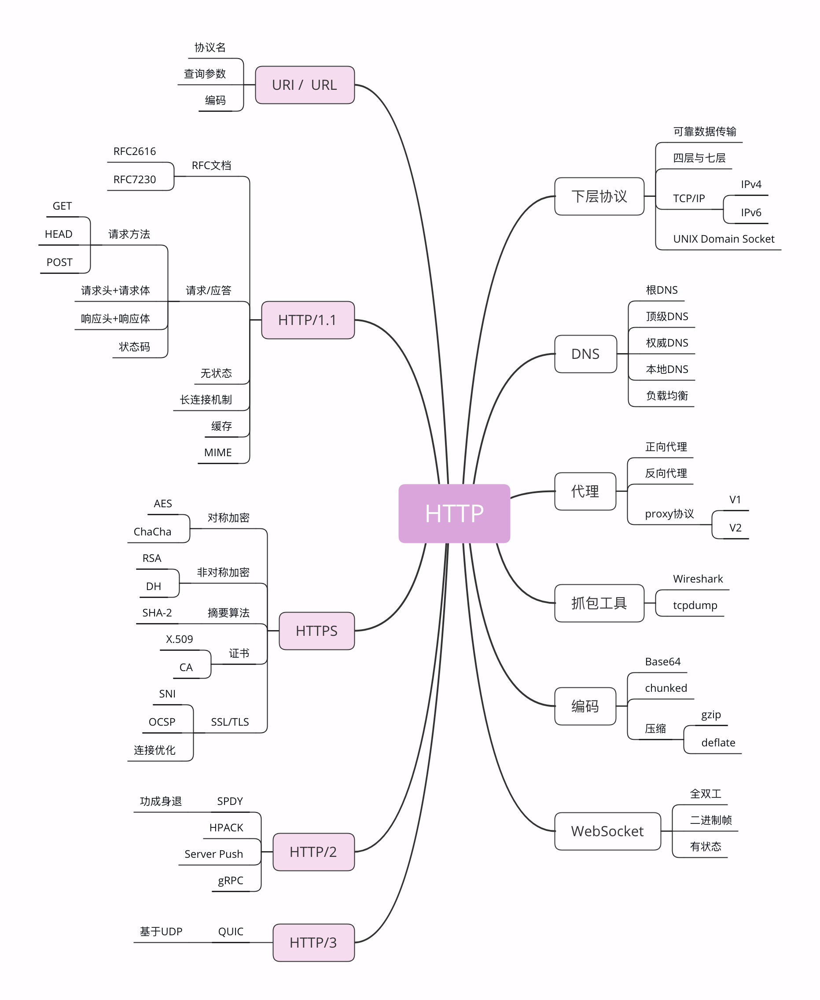

HTTP/1.1 主要的变更点有：
增加了 PUT、DELETE 等新的方法；
增加了缓存管理和控制；
明确了连接管理，允许持久连接；
允许响应数据分块（chunked），利于传输大文件；
强制要求 Host 头，让互联网主机托管成为可能。

缺点：
主要就是连接慢

HTTP/2 的制定充分考虑了现今互联网的现状：
宽带、移动、不安全，在高度兼容 HTTP/1.1 的同时在性能改善方面做了很大努力，

主要的特点有：二进制协议，不再是纯文本；
可发起多个请求，废弃了 1.1 里的管道；
使用专用算法压缩头部，减少数据传输量；
允许服务器主动向客户端推送数据；
增强了安全性，“事实上”要求加密通信。

HTTP 就是超文本传输协议，也就是 HyperText Transfer Protocol

它可以拆成三个部分，分别是：“超文本”“传输”和“协议”

HTTP 是一个用在计算机世界里的协议。它使用计算机能够理解的语言确立了一种计算机之间交流通信的规范，以及相关的各种控制和错误处理方式。

HTTP 是一个“传输协议”，所谓的“传输”（Transfer）其实很好理解，就是把一堆东西从 A 点搬到 B 点，或者从 B 点搬到 A 点，即“A<===>B”。
HTTP 是一个在计算机世界里专门用来在两点之间传输数据的约定和规范。

“文本”（Text），就表示 HTTP 传输的不是 TCP/UDP 这些底层协议里被切分的杂乱无章的二进制包（datagram），而是完整的、有意义的数据，可以被浏览器、服务器这样的上层应用程序处理。
“超文本”，就是“超越了普通文本的文本”，它是文字、图片、音频和视频等的混合体，最关键的是含有“超链接”，能够从一个“超文本”跳跃到另一个“超文本”，形成复杂的非线性、网状的结构关系。

编程语言是人与计算机沟通交流所使用的语言，而 HTTP 是计算机与计算机沟通交流的语言。

CDN，
全称是“Content Delivery Network”，翻译过来就是“内容分发网络”。它应用了 HTTP 协议里的缓存和代理技术，代替源站响应客户端的请求。
它可以缓存源站的数据，让浏览器的请求不用“千里迢迢”地到达源站服务器，直接在“半路”就可以获取响应。

CDN 也是现在互联网中的一项重要基础设施，除了基本的网络加速外，还提供负载均衡、安全防护、边缘计算、跨运营商网络等功能，能够成倍地“放大”源站服务器的服务能力

Web  Service 
是一种由 W3C 定义的应用服务开发规范，使用 client-server 主从架构，通常使用 WSDL 定义服务接口，使用 HTTP 协议传输 XML 或 SOAP 消息，也就是说，它是一个基于 Web（HTTP）的服务架构技术
既可以运行在内网，也可以在适当保护后运行在外网。

WAF 
是近几年比较“火”的一个词，意思是“网络应用防火墙”。
应用层面的“防火墙”，专门检测 HTTP 流量，是防护 Web 应用的安全技术。
WAF 通常位于 Web 服务器之前，可以阻止如 SQL 注入、跨站脚本等攻击。

Http相关的协议

TCP/IP
TCP/IP 协议实际上是一系列网络通信协议的统称，其中最核心的两个协议是 TCP 和 IP，其他的还有 UDP、ICMP、ARP 等等，共同构成了一个复杂但有层次的协议栈。

IP 协议是“Internet Protocol”的缩写，主要目的是解决寻址和路由问题，以及如何在两点间传送数据包。

TCP 协议是“Transmission Control Protocol”的缩写，意思是“传输控制协议”，它位于 IP 协议之上，基于 IP 协议提供可靠的、字节流形式的通信，是 HTTP 协议得以实现的基础。
TCP 协议的两端可以如同操作文件一样访问传输的数据，就像是读写在一个密闭的管道里“流动”的字节。

DNS
域名系统”（Domain Name System）

URI/URL
URI（Uniform Resource Identifier），中文名称是 统一资源标识符，使用它就能够唯一地标记互联网上资源

URI 另一个更常用的表现形式是 URL（Uniform Resource Locator）， 统一资源定位符，网址。

Nginx 网站来举例，看一下 URI 是什么样子的。
http://nginx.org/en/download.html

URI 主要有三个基本的部分构成：
协议名：即访问该资源应当使用的协议，在这里是“http”；
主机名：即互联网上主机的标记，可以是域名或 IP 地址，在这里是“nginx.org”；
路径：即资源在主机上的位置，使用“/”分隔多级目录，在这里是“/en/download.html”。

HTTPS 
相当于“HTTP+SSL/TLS+TCP/IP”
SSL 使用了许多密码学最先进的研究成果，综合了对称加密、非对称加密、摘要算法、数字签名、数字证书等技术，能够在不安全的环境中为通信的双方创建出一个秘密的、安全的传输通道。

代理
代理（Proxy）是 HTTP 协议中请求方和应答方中间的一个环节，作为“中转站”，既可以转发客户端的请求，也可以转发服务器的应答。

匿名代理：完全“隐匿”了被代理的机器，外界看到的只是代理服务器；
透明代理：顾名思义，它在传输过程中是“透明开放”的，外界既知道代理，也知道客户端；
正向代理：靠近客户端，代表客户端向服务器发送请求；
反向代理：靠近服务器端，代表服务器响应客户端的请求；

代理做的事情
负载均衡：把访问请求均匀分散到多台机器，实现访问集群化；
内容缓存：暂存上下行的数据，减轻后端的压力；
安全防护：隐匿 IP, 使用 WAF 等工具抵御网络攻击，保护被代理的机器；
数据处理：提供压缩、加密等额外的功能。

4层协议：

第一层叫“链接层”（link layer）。又叫mac层，对应网卡，使用 MAC 地址来标记网络上的设备，发送原始数据包。
传输单位是帧（frame）

第二层叫“网际层”。IP协议，用 IP 地址取代 MAC 地址，连接成一个虚拟的巨大网络。
传输单位是包（packet）

第三层叫“传输层”。TCP/UDP协议，保证数据在 IP 地址标记的两点之间“可靠”地传输。
TCP 的数据是连续的“字节流”，有先后顺序，而 UDP 则是分散的小数据包，是顺序发，乱序收。
传输单位是段（segment）

第四层叫“应用层”。有各种面向具体应用的协议。例如 Telnet、SSH、FTP、SMTP 
HTTP等。
HTTP 的传输单位则是消息或报文（message）

域名

你要访问“www.apple.com”，就要进行下面的三次查询：
1.访问根域名服务器，它会告诉你“com”顶级域名服务器的地址；
2.访问“com”顶级域名服务器，它再告诉你“apple.com”域名服务器的地址；
3.最后访问“apple.com”域名服务器，就得到了“www.apple.com”的地址。

在核心 DNS 系统之外，还有两种手段用来减轻域名解析的压力，并且能够更快地获取结果，基本思路就是“缓存”。

一。许多大公司、网络运行商都会建立自己的 DNS 服务器，作为用户 DNS 查询的代理，代替用户访问核心 DNS 系统。

这些 DNS 服务器的数量要比核心系统的服务器多很多，而且大多部署在离用户很近的地方。
比较知名的 DNS 有 Google 的“8.8.8.8”，Microsoft 的“4.2.2.1”，还有 CloudFlare 的“1.1.1.1”等等。

二。操作系统里也会对 DNS 解析结果做缓存，如果你之前访问过“www.apple.com”，那么下一次在浏览器里再输入这个网址的时候就不会再跑到 DNS 那里去问了，直接在操作系统里就可以拿到 IP 地址。

操作系统里还有一个特殊的“主机映射”文件，通常是一个可编辑的文本，在 Linux 里是“/etc/hosts”。

Nginx 里有这么一条配置指令“resolver”，它就是用来配置 DNS 服务器的，如果没有它，那么 Nginx 就无法查询域名对应的 IP，也就无法反向代理到外部的网站。

resolver 8.8.8.8 valid=30s;  #指定Google的DNS，缓存30秒

