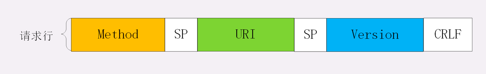
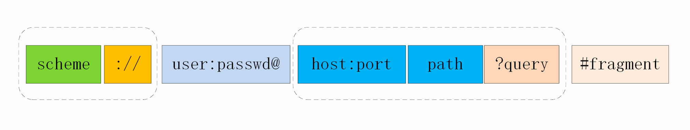

最简单的浏览器 HTTP 请求过程：

最简单的浏览器 HTTP 请求过程：
浏览器从地址栏的输入中获得服务器的 IP 地址和端口号；
浏览器用 TCP 的三次握手与服务器建立连接；
浏览器向服务器发送拼好的报文；
服务器收到报文后处理请求，同样拼好报文再发给浏览器；
浏览器解析报文，渲染输出页面。

目标网站的服务器对外表现的是一个 IP 地址，但为了能够扛住高并发，在内部也是一套复杂的架构。通常在入口是负载均衡设备，例如四层的 LVS 或者七层的 Nginx，在后面是许多的服务器，构成一个更强更稳定的集群。

负载均衡设备会先访问系统里的缓存服务器，通常有 memory 级缓存 Redis 和 disk 级缓存 Varnish，它们的作用与 CDN 类似，不过是工作在内部网络里，把最频繁访问的数据缓存几秒钟或几分钟，减轻后端应用服务器的压力。

如果缓存服务器里也没有，那么负载均衡设备就要把请求转发给应用服务器了。它们又会再访问后面的 MySQL、PostgreSQL、MongoDB 等数据库服务.

tcp结构

http报文结构

     起始行（start line）：描述请求或响应的基本信息；
     头部字段集合（header）：使用 key-value 形式更详细地说明报文；
     消息正文（entity）：实际传输的数据，它不一定是纯文本，可以是图片、视频等二进制数据。

前两部分起始行和头部字段经常又合称为“请求头”或“响应头”，消息正文又称为“实体”，但与“header”对应，很多时候就直接称为“body”。

HTTP 协议规定报文必须有 header，但可以没有 body，而且在 header 之后必须要有一个“空行”，也就是“CRLF”，十六进制的“0D0A”。

第一行“GET / HTTP/1.1”就是请求行，而后面的“Host”“Connection”等等都属于 header，报文的最后是一个空白行结束，没有 body。

请求行由三部分构成：
    GET / HTTP/1.1

    请求方法：是一个动词，如 GET/POST，表示对资源的操作；
    请求目标：通常是一个 URI，标记了请求方法要操作的资源；
    版本号：表示报文使用的 HTTP 协议版本。

这三个部分通常使用空格（space）来分隔，最后要用 CRLF 换行表示结束。

状态行：服务器响应的状态： 同样也是由三部分构成：

    HTTP/1.1 200 OK
    HTTP/1.1 404 Not Found

    版本号：表示报文使用的 HTTP 协议版本；
    状态码：一个三位数，用代码的形式表示处理的结果，比如 200 是成功，500 是服务器错误；
    原因：作为数字状态码补充，是更详细的解释文字，帮助人理解原因。

头部字段

头部字段是 key-value 的形式，key 和 value 之间用“:”分隔，最后用 CRLF 换行表示字段结束。
比如在“Host: 127.0.0.1”这一行里 key 就是“Host”，value 就是“127.0.0.1”。

1.字段名不区分大小写，例如“Host”也可以写成“host”。
2.字段名里不允许出现空格，可以使用连字符“-”，但不能使用下划线“_”。 如：x-virtual-env:feature-lxf-test
3.字段名后面必须紧接着“:”，不能有空格，而“:”后的字段值前可以有多个空格。
4.字段的顺序是没有意义。
5.字段原则上不能重复。

目前 HTTP/1.1 规定了八种方法，单词都必须是大写的形式，

    GET：获取资源，可以理解为读取或者下载数据；
    HEAD：获取资源的元信息；
    POST：向资源提交数据，相当于写入或上传数据；
    PUT：类似 POST；
    DELETE：删除资源；
    CONNECT：建立特殊的连接隧道；
    OPTIONS：列出可对资源实行的方法；
    TRACE：追踪请求 - 响应的传输路径。

URI，也就是统一资源标识符（Uniform Resource Identifier）
本质上是一个字符串，这个字符串的作用是唯一地标记资源的位置或者名字。
但有部分可以视情况省略。

网址实际上是 URL——统一资源定位符（Uniform Resource Locator）

URI 的格式
由 scheme、host:port、path 和 query 四个部分组成，

    http://nginx.org
    http://www.chrono.com:8080/11-1
    https://tools.ietf.org/html/rfc7230
    file:///D:/http_study/www/

    https://search.jd.com/Search?keyword=openresty&enc=utf-8&qrst=1&rt=1&stop=1&vt=2&wq=openresty&psort=3&click=0

URI 引入了编码机制，对于 ASCII 码以外的字符集和特殊字符做一个特殊的操作，把它们转换成与 URI 语义不冲突的形式。这在 RFC 规范里称为“escape”和“unescape”，俗称“转义”
直接把非 ASCII 码或特殊字符转换成十六进制字节值，然后前面再加上一个“%”。

状态码（Status Code）

1××：提示信息，表示目前是协议处理的中间状态，还需要后续的操作；
2××：成功，报文已经收到并被正确处理；
3××：重定向，资源位置发生变动，需要客户端重新发送请求；
4××：客户端错误，请求报文有误，服务器无法处理；
5××：服务器错误，服务器在处理请求时内部发生了错误。

“204 No Content”
“206 Partial Content”是 HTTP 分块下载或断点续传的基础，在客户端发送“范围请求”、要求获取资源的部分数据时出现，它与 200 一样，也是服务器成功处理了请求，但 body 里的数据不是资源的全部，而是其中的一部分。

“400 Bad Request”
“403 Forbidden”
“404 Not Found”

“500 Internal Server Error”
“501 Not Implemented”
“502 Bad Gateway” 服务器作为网关或者代理时返回的错误码，表示服务器自身工作正常，访问后端服务器时发生了错误，但具体的错误原因也是不知道的
“503 Service Unavailable”表示服务器当前很忙，暂时无法响应服务.所以 503 响应报文里通常还会有一个“Retry-After”字段，指示客户端可以在多久以后再次尝试发送请求。

http特点

“灵活可扩展”
用空格分隔单词，换行分隔字段，“header+body”等

可靠”的传输协议。

应用层的协议

是请求 - 应答通信模式， 半双工。 

无状态的。
状态：客户端或者服务器里保存的一些数据或者标志，记录了通信过程中的一些变化信息。

TCP 协议是有状态的，一开始处于 CLOSED 状态，连接成功后是 ESTABLISHED 状态，断开连接后是 FIN-WAIT 状态，最后又是 CLOSED 状态。

缺点：
明文传输，不安全。

