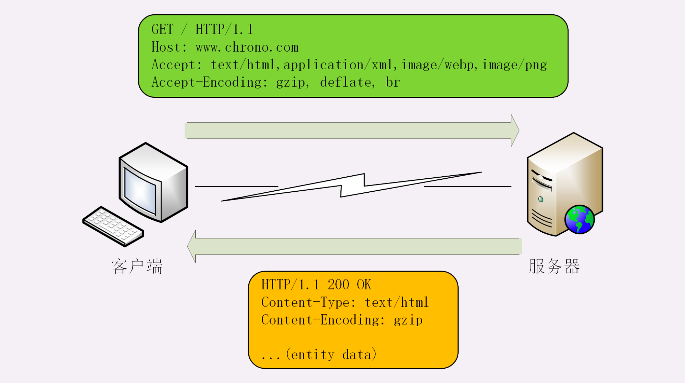
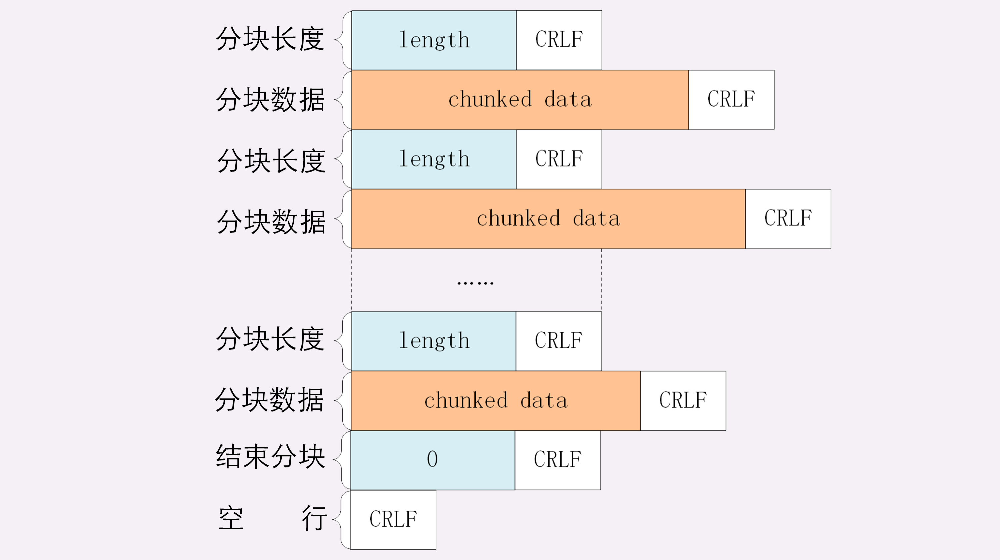

package __http进阶

数据类型与编码

MIME 是一个很大的标准规范
MIME 把数据分成了八大类，每个大类下再细分出多个子类，形式是“type/subtype”的字符串。

        text：即文本格式的可读数据，我们最熟悉的应该就是 text/html ，表示超文本文档，此外还有纯文本 text/plain、样式表 text/css 等。
        image：即图像文件，有 image/gif、image/jpeg、image/png 等。
        audio/video：音频和视频数据，例如 audio/mpeg、video/mp4 等。
        application：数据格式不固定，可能是文本也可能是二进制,常见的有 application/json，application/javascript、application/pdf 等。

“Encoding type”，告诉数据是用的什么编码格式，这样对方才能正确解压缩，还原出原始的数据。

    gzip：GNU zip 压缩格式，也是互联网上最流行的压缩格式；
    deflate：zlib（deflate）压缩格式，流行程度仅次于 gzip；
    br：一种专门为 HTTP 优化的新压缩算法（Brotli）。

HTTP 协议为此定义了两个 Accept 请求头字段和两个 Content 实体头字段，用于客户端和服务器进行“内容协商”。
客户端用 Accept 头告诉服务器希望接收什么样的数据，而服务器用 Content 头告诉客户端实际发送了什么样的数据。

Accept 字段标记的是客户端可理解的 MIME type，可以用“,”做分隔符列出多个类型，让服务器有更多的选择余地，
    
    Accept: text/html,application/xml,image/webp,image/png

服务器会在响应报文里用头字段 Content-Type 告诉实体数据的真实类型:

    Content-Type: text/html
    Content-Type: image/png

Accept-Encoding 字段标记的是客户端支持的压缩格式，例如上面说的 gzip、deflate 等，同样也可以用“,”列出多个，服务器可以选择其中一种来压缩数据，实际使用的压缩格式放在响应头字段 Content-Encoding 里。

    Accept-Encoding: gzip, deflate, br
    Content-Encoding: gzip

语言类型使用的头字段

    Accept-Language: zh-CN, zh, en

服务器应该在响应报文里用头字段 Content-Language 告诉客户端实体数据使用的实际语言类型：

    Content-Language: zh-CN

字符集

    Accept-Charset: gbk, utf-8
    Content-Type: text/html; charset=utf-8

HTTP传输大文件的方法

数据压缩
Accept-Encoding: gzip、deflate、br 。gzip 等压缩算法通常只对文本文件有较好的压缩率

分块传输

在 HTTP 协议里就是“chunked”分块传输编码。
在响应报文里用头字段“Transfer-Encoding: chunked”来表示，意思是报文里的 body 部分不是一次性发过来的，而是分成了许多的块（chunk）逐个发送。

    1.每个分块包含两个部分，长度头和数据块；
    2.长度头是以 CRLF（回车换行，即\r\n）结尾的一行明文，用 16 进制数字表示长度；
    3.数据块紧跟在长度头后，最后也用 CRLF 结尾，但数据不包含 CRLF；
    4.最后用一个长度为 0 的块表示结束，即“0\r\n\r\n”。

浏览器在收到分块传输的数据后会自动按照规则去掉分块编码，重新组装出内容，所以想要看到服务器发出的原始报文形态就得用 Telnet 手工发送请求（或者用 Wireshark 抓包）：

    GET /16-1 HTTP/1.1
    Host: www.chrono.com

范围请求

不仅看视频的拖拽进度需要范围请求，常用的下载工具里的多段下载、断点续传也是基于它实现的，

Accept-Ranges: bytes

    “0-”表示从文档起点到文档终点，相当于“0-99”，即整个文件；
    “10-”是从第 10 个字节开始到文档末尾，相当于“10-99”；
    “-1”是文档的最后一个字节，相当于“99-99”；
    “-10”是从文档末尾倒数 10 个字节，相当于“90-99”
请求：

    GET /16-2 HTTP/1.1
    Host: www.chrono.com
    Range: bytes=0-31
响应：

    HTTP/1.1 206 Partial Content
    Content-Length: 32
    Accept-Ranges: bytes
    Content-Range: bytes 0-31/96
    
    // this is a plain text json doc