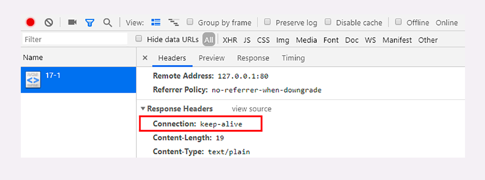

连接管理

短连接的缺点相当严重，因为在 TCP 协议里，建立连接和关闭连接都是非常“昂贵”的操作。
TCP 建立连接要有“三次握手”，发送 3 个数据包，需要 1 个 RTT；
关闭连接是“四次挥手”，4 个数据包需要 2 个 RTT。

“长连接”的通信方式，也叫“持久连接”（persistent connections）、“连接保活”（keep alive）、“连接复用”（connection reuse）。

“成本均摊”的思路，既然 TCP 的连接和关闭非常耗时间，那么就把这个时间成本由原来的一个“请求 - 应答”均摊到多个“请求 - 应答”上。

在 HTTP/1.1 中的连接都会默认启用长连接

只要向服务器发送了第一次请求，后续的请求都会重复利用第一次打开的 TCP 连接，也就是长连接，在这个连接上收发数据。

如果服务器支持长连接，它总会在响应报文里放一个“Connection: keep-alive”字段。

缺点：占用了服务器的资源。如果有大量的空闲长连接只连不发，就会很快耗尽服务器的资源，导致服务器无法为真正有需要的用户提供服务。

在客户端，可以在请求头里加上“Connection: close”字段，告诉服务器：“这次通信后就关闭连接”。
服务器看到这个字段，就知道客户端要主动关闭连接，于是在响应报文里也加上这个字段，发送之后就调用 Socket API 关闭 TCP 连接。

服务器端通常不会主动关闭连接，但也可以使用一些策略。 拿 Nginx 来举例，它有两种方式：

1.使用“keepalive_timeout”指令，设置长连接的超时时间，如果在一段时间内连接上没有任何数据收发就主动断开连接，避免空闲连接占用系统资源。
2.使用“keepalive_requests”指令，设置长连接上可发送的最大请求次数。比如设置成 1000，那么当 Nginx 在这个连接上处理了 1000 个请求后，也会主动断开连接。

队头阻塞

与短连接和长连接无关，而是由 HTTP 基本的“请求 - 应答”模型所导致的。

因为 HTTP 规定报文必须是“一发一收”，这就形成了一个先进先出的“串行”队列。队列里的请求没有轻重缓急的优先级，只有入队的先后顺序，排在最前面的请求被最优先处理。

如果队首的请求因为处理的太慢耽误了时间，那么队列里后面的所有请求也不得不跟着一起等待。

外部重定向，服务器会把重定向的地址给浏览器，然后浏览器再次的发起请求，地址栏的地址变化了。
内部重定向，服务器会直接把重定向的资源返给浏览器，不需要再次在浏览器发起请求，地址栏的地址不变。
重定向我的经验，主要用在未登录或者权限不足的场景，跳转到对应的登录或提升页面之中。
当然，通用的SSO也是这样做的

