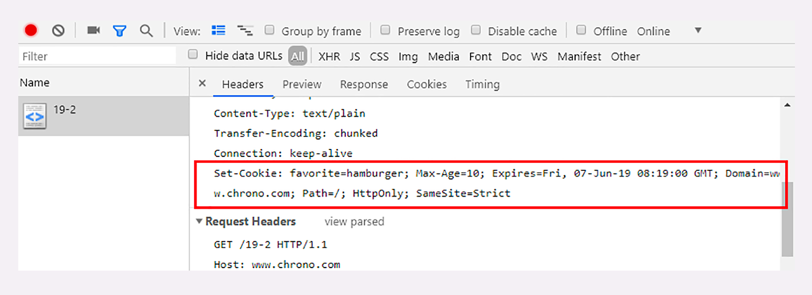

cookie

Cookie 的属性

Cookie 的有效期可以使用 Expires 和 Max-Age 两个属性来设置。

    “Expires”俗称“过期时间”，用的是绝对时间点，可以理解为“截止日期”（deadline）。
    “Max-Age”用的是相对时间，单位是秒，浏览器用收到报文的时间点再加上 Max-Age，就可以得到失效的绝对时间。

设置 Cookie 的作用域，让浏览器仅发送给特定的服务器和 URI，避免被其他网站盗用。

作用域的设置比较简单，“Domain”和“Path”指定了 Cookie 所属的域名和路径，浏览器在发送 Cookie 前会从 URI 中提取出 host 和 path 部分。

Cookie 的安全性
在 JS 脚本里可以用 document.cookie 来读写 Cookie 数据，这就带来了安全隐患，有可能会导致“跨站脚本”（XSS）攻击窃取数据。

属性“HttpOnly”会告诉浏览器，此 Cookie 只能通过浏览器 HTTP 协议传输，禁止其他方式访问，浏览器的 JS 引擎就会禁用 document.cookie 等一切相关的 API，脚本攻击也就无从谈起了。

另一个属性“SameSite”可以防范“跨站请求伪造”（XSRF）攻击，设置成“SameSite=Strict”可以严格限定 Cookie 不能随着跳转链接跨站发送，而“SameSite=Lax”则略宽松一点，允许 GET/HEAD 等安全方法，但禁止 POST 跨站发送。

还有一个属性叫“Secure”，表示这个 Cookie 仅能用 HTTPS 协议加密传输，明文的 HTTP 协议会禁止发送。但 Cookie 本身不是加密的，浏览器里还是以明文的形式存在。

Cookie 的应用

1.身份识别，保存用户的登录信息，实现会话事务。
2.广告跟踪。

你上网的时候肯定看过很多的广告图片，这些图片背后都是广告商网站（例如 Google），它会“偷偷地”给你贴上 Cookie 小纸条，这样你上其他的网站，别的广告就能用 Cookie 读出你的身份，然后做行为分析，再推给你广告。

