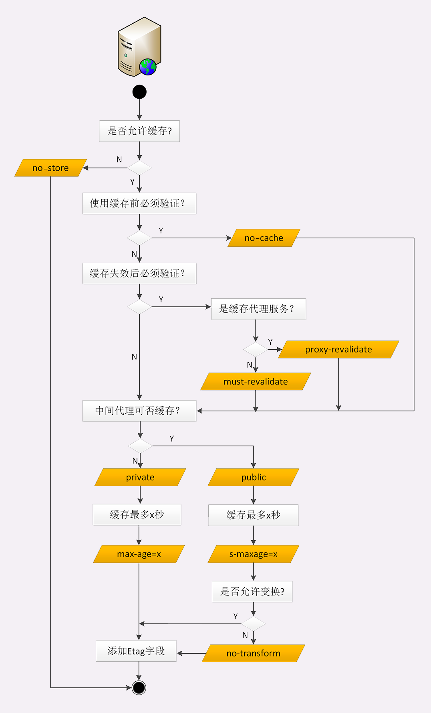
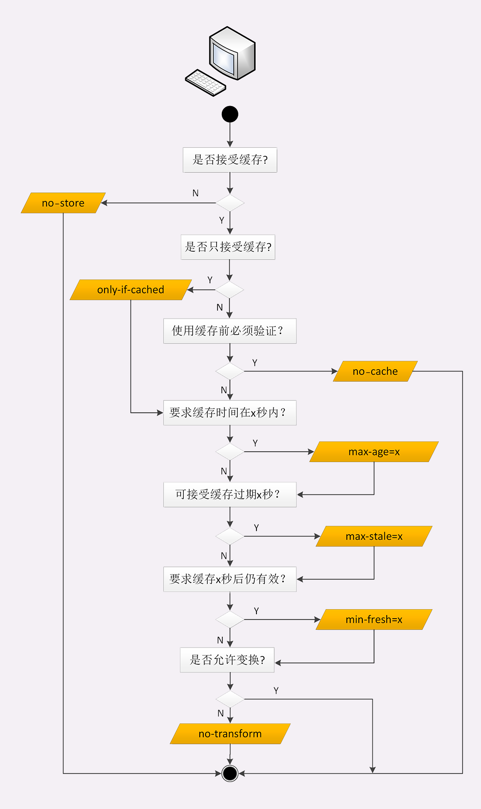

浏览器发现缓存无数据，于是发送请求，向服务器获取资源；

服务器响应请求，返回资源，同时标记资源的有效期；

浏览器缓存资源，等待下次重用。

服务器标记资源有效期使用的头字段是“Cache-Control”，里面的值“max-age=30”就是资源的有效时间，相当于告诉浏览器，“这个页面只能缓存 30 秒，之后就算是过期，不能用。”

“Cache-Control”字段里的“max-age”和上一讲里 Cookie 有点像，都是标记资源的有效期。
里的 max-age 是“生存时间”，时间的计算起点是响应报文的创建时刻（即 Date 字段，也就是离开服务器的时刻），而不是客户端收到报文的时刻，也就是说包含了在链路传输过程中所有节点所停留的时间。

“max-age”是 HTTP 缓存控制最常用的属性，此外在响应报文里还可以用其他的属性来更精确地指示浏览器应该如何使用缓存：

    no-store：不允许缓存，用于某些变化非常频繁的数据，例如秒杀页面；
    no-cache：它的字面含义容易与 no-store 搞混，实际的意思并不是不允许缓存，而是可以缓存，但在使用之前必须要去服务器验证是否过期，是否有最新的版本；
    must-revalidate：又是一个和 no-cache 相似的词，它的意思是如果缓存不过期就可以继续使用，但过期了如果还想用就必须去服务器验证。

拿生鲜速递来举例说明一下：

    no-store：买来的西瓜不允许放进冰箱，要么立刻吃，要么立刻扔掉；
    no-cache：可以放进冰箱，但吃之前必须问超市有没有更新鲜的，有就吃超市里的；
    must-revalidate：可以放进冰箱，保鲜期内可以吃，过期了就要问超市让不让吃。

条件请求一共有 5 个头字段，我们最常用的是 “if-Modified-Since”和“If-None-Match”这两个。
需要第一次的响应报文预先提供“Last-modified”和“ETag”，然后第二次请求时就可以带上缓存里的原值，验证资源是否是最新的。

ETag 是“实体标签”（Entity Tag）的缩写，是资源的一个唯一标识，主要是用来解决修改时间无法准确区分文件变化的问题。

代理服务

“代理服务”就是指服务本身不生产内容，而是处于中间位置转发上下游的请求和响应，具有双重身份：

“计算机科学领域里的任何问题，都可以通过引入一个中间层来解决”（在这句话后面还可以再加上一句“如果一个中间层解决不了问题，那就再加一个中间层”）

代理作用：
“欺上瞒下”。负载均衡。

健康检查。
安全防护。
加密卸载。
数据过滤。
内容缓存。

代理服务器需要用字段“Via”标明代理的身份。

最常用的两个头字段是
“X-Forwarded-For”：为谁而转发。
“X-Real-IP”：另一种获取客户端真实 IP 的手段，它的作用很简单，就是记录客户端 IP 地址，没有中间的代理信息。

缓存代理

