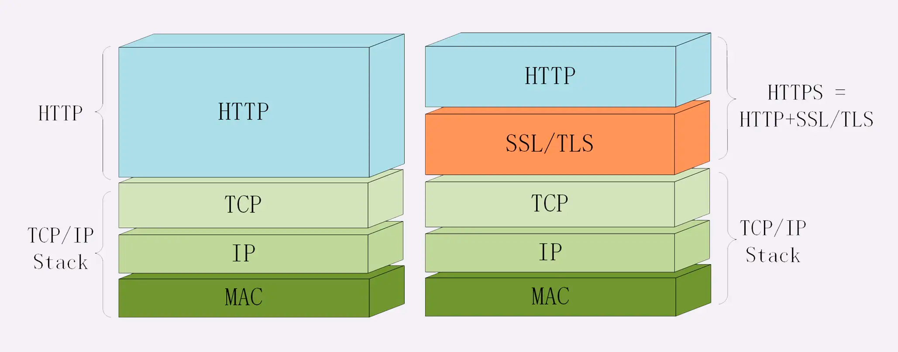

“https”，默认端口号 443

OpenSSL
说到 TLS，就不能不谈到 OpenSSL，它是一个著名的开源密码学程序库和工具包，几乎支持所有公开的加密算法和协议，已经成为了事实上的标准，许多应用软件都会使用它作为底层库来实现 TLS 功能，包括常用的 Web 服务器 Apache、Nginx 等

HTTPS 的安全性是由 TLS 来保证的。
TLS 由记录协议、握手协议、警告协议、变更密码规范协议、扩展协议等几个子协议组成，综合使用了对称加密、非对称加密、身份认证等许多密码学前沿技术。

机密性由对称加密AES保证，完整性由SHA384摘要算法保证，身份认证和不可否认由RSA非对称加密保证.

