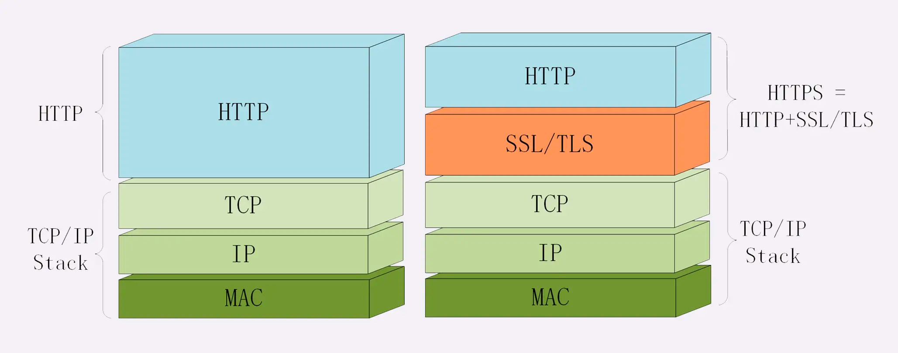

“https”，默认端口号 443

OpenSSL
说到 TLS，就不能不谈到 OpenSSL，它是一个著名的开源密码学程序库和工具包，几乎支持所有公开的加密算法和协议，已经成为了事实上的标准，许多应用软件都会使用它作为底层库来实现 TLS 功能，包括常用的 Web 服务器 Apache、Nginx 等

HTTPS 的安全性是由 TLS 来保证的。
TLS 由记录协议、握手协议、警告协议、变更密码规范协议、扩展协议等几个子协议组成，综合使用了对称加密、非对称加密、身份认证等许多密码学前沿技术。

机密性由对称加密AES保证，完整性由SHA384摘要算法保证，身份认证和不可否认由RSA非对称加密保证.

HTTPS 连接大致上可以划分为两个部分：
第一个是建立连接时的非对称加密握手，第二个是握手后的对称加密报文传输。

“HTTPS 连接慢”指的就是刚开始建立连接的那段时间。

在 TCP 建连之后，正式数据传输之前，HTTPS 比 HTTP 增加了一个 TLS 握手的步骤，这个步骤最长可以花费两个消息往返，也就是 2-RTT。
而且在握手消息的网络耗时之外，还会有其他的一些“隐形”消耗，比如：1.产生用于密钥交换的临时公私钥对（ECDHE）；2.验证证书时访问 CA 获取 CRL 或者 OCSP；3.非对称加密解密处理“Pre-Master”。

配置 HTTPS
搞定了证书，接下来就是配置 Web 服务器，在 443 端口上开启 HTTPS 服务了。
这在 Nginx 上非常简单，只要在“listen”指令后面加上参数“ssl”，再配上刚才的证书文件就可以实现最基本的 HTTPS。

    listen                443 ssl;
    
    ssl_certificate       xxx_rsa.crt;  #rsa2048 cert
    ssl_certificate_key   xxx_rsa.key;  #rsa2048 private key
    
    ssl_certificate       xxx_ecc.crt;  #ecdsa cert
    ssl_certificate_key   xxx_ecc.key;  #ecdsa private key

重定向跳转

    return 301 https://$host$request_uri;             #永久重定向
    rewrite ^  https://$host$request_uri permanent;   #永久重定向
