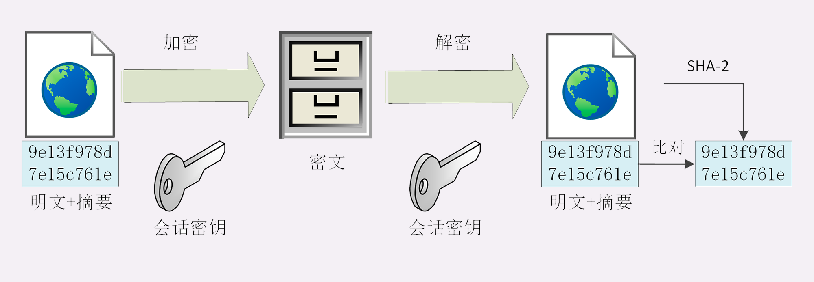
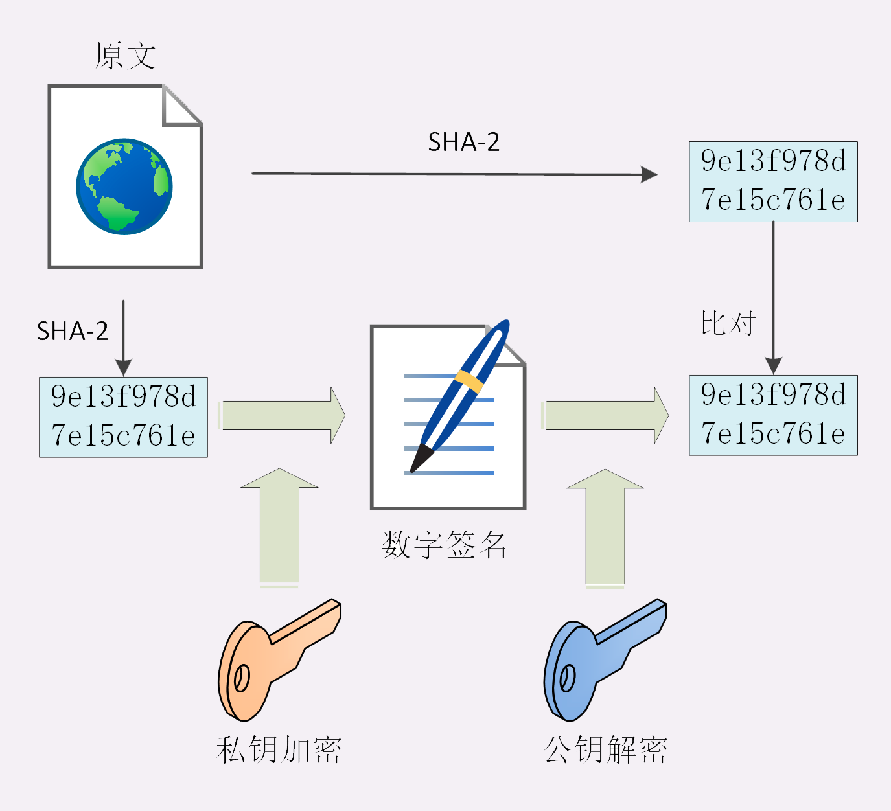

摘要算法

实现完整性的手段主要是摘要算法（Digest Algorithm），也就是常说的散列函数、哈希函数（Hash Function）

把数据从一个“大空间”映射到了“小空间”，所以就存在“冲突”（collision，也叫碰撞）的可能性。

最常用的两个摘要算法：MD5（Message-Digest 5）、SHA-1（Secure Hash Algorithm 1），能够生成 16 字节和 20 字节长度的数字摘要。（安全性低）

SHA-2 实际上是一系列摘要算法的统称，总共有 6 种，常用的有 SHA224、SHA256、SHA384，分别能够生成 28 字节、32 字节、48 字节的摘要。

在混合加密系统里用会话密钥加密消息和摘要，这样黑客无法得知明文，也就没有办法动手脚。

哈希消息认证码（HMAC）

数字签名

使用私钥再加上摘要算法，就能够实现“数字签名”。

签名和公钥一样完全公开，任何人都可以获取。但这个签名只有用私钥对应的公钥才能解开，拿到摘要后，再比对原文验证完整性，就可以像签署文件一样证明消息确实是你发的。

刚才的这两个行为也有专用术语，叫做“签名”和“验签”。

只要你和网站互相交换公钥，就可以用“签名”和“验签”来确认消息的真实性，因为私钥保密，黑客不能伪造签名，就能够保证通信双方的身份。

数字证书和 CA

CA（Certificate Authority，证书认证机构）。它就像网络世界里的公证中心，具有极高的可信度，由它来给各个公钥签名，用自身的信誉来保证公钥无法伪造，是可信的。

包含序列号、用途、颁发者、有效时间等等，把这些打成一个包再签名，完整地证明公钥关联的各种信息，形成“数字证书”（Certificate）

