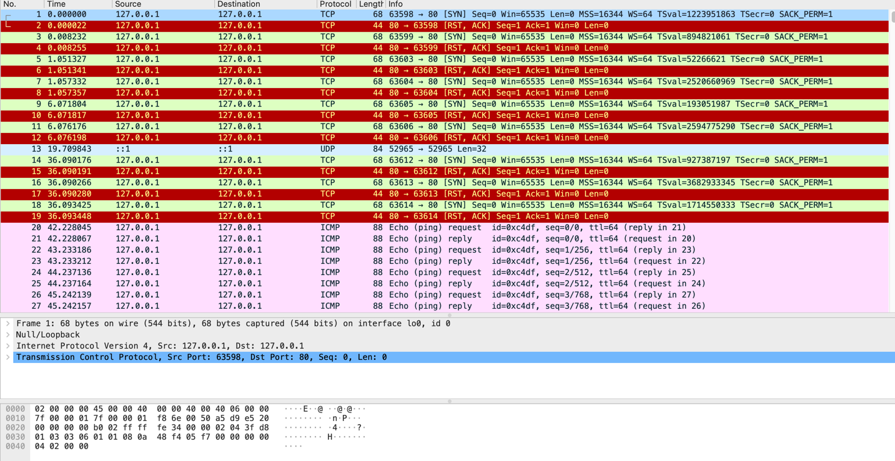

https://blog.csdn.net/m0_37806112/article/details/82776806
   
    me@localhostt http % ping 127.0.0.1
    PING 127.0.0.1 (127.0.0.1): 56 data bytes
    64 bytes from 127.0.0.1: icmp_seq=0 ttl=64 time=0.065 ms
    64 bytes from 127.0.0.1: icmp_seq=1 ttl=64 time=0.091 ms
    64 bytes from 127.0.0.1: icmp_seq=2 ttl=64 time=0.087 ms
    64 bytes from 127.0.0.1: icmp_seq=3 ttl=64 time=0.063 ms
    64 bytes from 127.0.0.1: icmp_seq=4 ttl=64 time=0.052 ms
    64 bytes from 127.0.0.1: icmp_seq=5 ttl=64 time=0.101 ms
    64 bytes from 127.0.0.1: icmp_seq=6 ttl=64 time=0.085 ms
    64 bytes from 127.0.0.1: icmp_seq=7 ttl=64 time=0.125 ms
    64 bytes from 127.0.0.1: icmp_seq=8 ttl=64 time=0.085 ms
    ^C
    --- 127.0.0.1 ping statistics ---
    9 packets transmitted, 9 packets received, 0.0% packet loss
    round-trip min/avg/max/stddev = 0.052/0.084/0.125/0.021 ms
    me@localhostt http %

ping工作过程——

假定主机A的IP地址是192.168.1.1，主机B的IP地址是192.168.1.2，都在同一子网内，则当你在主机A上运行“ping 192.168.1.2”后，都发生了些什么呢?

      首先，ping命令会构建一个固定格式的ICMP请求数据包，然后由ICMP协议将这个数据包连同地址“192.168.1.2”一起交给IP层协议（和ICMP一样，实际上是一组后台运行的进程），IP层协议将以地址“192.168.1.2”作为目的地址，本机IP地址作为源地址，加上一些其他的控制信息，构建一个IP数据包，并在一个映射表中查找出IP地址192.168.1.2所对应的物理地址（也叫MAC地址，熟悉网卡配置的朋友不会陌生，这是数据链路层协议构建数据链路层的传输单元——帧所必需的），一并交给数据链路层。后者构建一个数据帧，目的地址是IP层传过来的物理地址，源地址则是本机的物理地址，还要附加上一些控制信息，依据以太网的介质访问规则，将它们传送出去。

      其中映射表由ARP实现。ARP(Address Resolution Protocol)是地址解析协议,是一种将IP地址转化成物理地址的协议。ARP具体说来就是将网络层（IP层，也就是相当于OSI的第三层）地址解析为数据连接层（MAC层，也就是相当于OSI的第二层）的MAC地址。

      主机B收到这个数据帧后，先检查它的目的地址，并和本机的物理地址对比，如符合，则接收；否则丢弃。接收后检查该数据帧，将IP数据包从帧中提取出来，交给本机的IP层协议。同样，IP层检查后，将有用的信息提取后交给ICMP协议，后者处理后，马上构建一个ICMP应答包，发送给主机A，其过程和主机A发送ICMP请求包到主机B一模一样。

即先由IP地址，在网络层传输，然后再根据mac地址由数据链路层传送到目的主机。

IMCP协议介绍
前面讲到了，IP协议并不是一个可靠的协议，它不保证数据被送达，那么，自然的，保证数据送达的工作应该由其他的模块来完成。其中一个重要的模块就是ICMP(网络控制报文)协议。

当传送IP数据包发生错误－－比如主机不可达，路由不可达等等，ICMP协议将会把错误信息封包，然后传送回给主机。给主机一个处理错误的机会，这 也就是为什么说建立在IP层以上的协议是可能做到安全的原因。ICMP数据包由8bit的错误类型和8bit的代码和16bit的校验和组成。而前 16bit就组成了ICMP所要传递的信息。

尽管在大多数情况下，错误的包传送应该给出ICMP报文，但是在特殊情况下，是不产生ICMP错误报文的。如下

ICMP差错报文不会产生ICMP差错报文（除ICMP查询报文）（防止ICMP的无限产生和传送）
目的地址是广播地址或多播地址的IP数据报。
作为链路层广播的数据报。
不是IP分片的第一片。
源地址不是单个主机的数据报。这就是说，源地址不能为零地址、环回地址、广播地 址或多播地址。
虽然里面的一些规定现在还不是很明白，但是所有的这一切规定，都是为了防止产生ICMP报文的无限传播而定义的。

ICMP协议大致分为两类，一种是查询报文，一种是差错报文。其中查询报文有以下几种用途:

ping查询

子网掩码查询（用于无盘工作站在初始化自身的时候初始化子网掩码）

时间戳查询（可以用来同步时间）

而差错报文则产生在数据传送发生错误的时候。就不赘述了。

ping可以说是ICMP的最著名的应用，当我们某一个网站上不去的时候。通常会ping一下这个网站。ping会回显出一些有用的信息。一般的信息如下:

    Reply from 10.4.24.1: bytes=32 time<1ms TTL=255
    Reply from 10.4.24.1: bytes=32 time<1ms TTL=255
    Reply from 10.4.24.1: bytes=32 time<1ms TTL=255
    Reply from 10.4.24.1: bytes=32 time<1ms TTL=255

    ping statistics for 10.4.24.1:
    Packets: Sent = 4, Received = 4, Lost = 0 (0% loss),
    Approximate round trip times in milli-seconds:
    Minimum = 0ms, Maximum = 0ms, Average = 0ms

ping这个单词源自声纳定位，而这个程序的作用也确实如此，它利用ICMP协议包来侦测另一个主机是否可达。原理是用类型码为0的ICMP发请 求，受到请求的主机则用类型码为8的ICMP回应。ping程序来计算间隔时间，并计算有多少个包被送达。用户就可以判断网络大致的情况。我们可以看到， ping给出来了传送的时间和TTL的数据。我给的例子不太好，因为走的路由少，有兴趣地可以ping一下国外的网站比如sf.net，就可以观察到一些 丢包的现象，而程序运行的时间也会更加的长。

ping还给我们一个看主机到目的主机的路由的机会。这是因为，ICMP的ping请求数据报在每经过一个路由器的时候，路由器都会把自己的ip放到该数据报中。而目的主机则会把这个ip列表复制到回应icmp数据包中发回给主机。但是，无论如何，ip头所能纪录的路由列表是非常的有限。如果要观察路由， 我们还是需要使用更好的工具，就是要讲到的Traceroute(windows下面的名字叫做tracert)。

ICMP的应用--Traceroute

        Traceroute是用来侦测主机到目的主机之间所经路由情况的重要工具，也是最便利的工具。前面说到，尽管ping工具也可以进行侦测，但是，因为ip头的限制，ping不能完全的记录下所经过的路由器。所以Traceroute正好就填补了这个缺憾。

       Traceroute的原理是非常非常的有意思，它受到目的主机的IP后，首先给目的主机发送一个TTL=1（还记得TTL是什么吗？）的UDP(后面就 知道UDP是什么了)数据包，而经过的第一个路由器收到这个数据包以后，就自动把TTL减1，而TTL变为0以后，路由器就把这个包给抛弃了，并同时产生 一个主机不可达的ICMP数据报给主机。主机收到这个数据报以后再发一个TTL=2的UDP数据报给目的主机，然后刺激第二个路由器给主机发ICMP数据 报。如此往复直到到达目的主机。这样，traceroute就拿到了所有的路由器ip。从而避开了ip头只能记录有限路由IP的问题。

