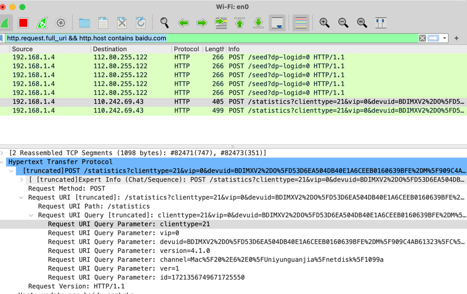

http.request.full_uri && http.host contains baidu.com
http.request.full_uri && ip.addr == 127.0.0.1

http.host == "baidu.com"

not arp
tcp.port == 443

ip.src == 192.168.1.1
ip.dst == 192.168.1.2

直播 RTMPT协议
